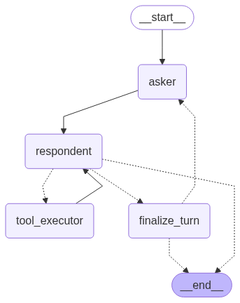
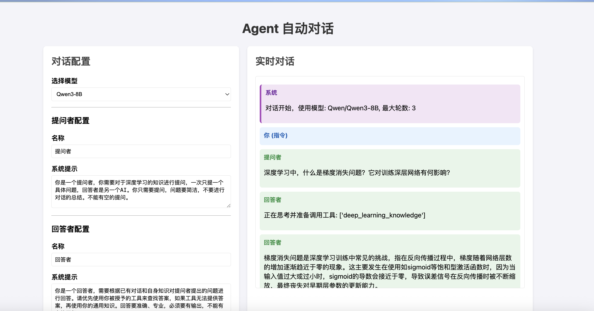

# Tiny RAG

这是一个轻量级的检索增强生成 (RAG) 项目，旨在提供一个简洁、可扩展的框架，用于构建和实验 RAG 应用。项目包含了一个基于 Web 的用户界面、一个具备工具使用能力的 Agent，以及一个模块化的 RAG 核心。
示例中通过将动[动手学深度学习](https://zh.d2l.ai/)的内容分块后通过嵌入模型分块向量化，构建向量数据库，通过将询问内容通过相同嵌入模型向量化，通过与向量库中每段的余弦相似度找到一个匹配的段落。
如果使用Reranker，则找到多个段落，与查询分别计算匹配得分找到最相关的段落。

在构建深度学习相关知识的向量库后，将 RAG 系统作为可调用的函数提供给 LLM，并使用 LangGraph 搭建两个智能体分别作为提问者与回答者，进行多轮问答，回答者可以使用工具进行查询。
使用 flask 搭建简单的 web 应用进行演示，可自定义选用模型， Agent 的系统提示，可选择的调用工具。

## ✨ 功能特性

- **模块化 RAG 核心**: 将 RAG 流程解耦为独立的模块（`embeddings`, `llm`, `reranker`, `vector_base`），方便单独替换和优化。
- **双 Agent 对话系统**: 内置两个 Agent (`Asker` 和 `Respondent`) 进行多轮对话。`Respondent` Agent 能够根据需要调用外部工具来辅助回答。
- **Web 用户界面**: 提供一个简单的前端界面 (`app/`)，用于 RAG 进行提问和对话的演示，可以自定义对话的内容，以及回答者可调用的工具。使用 flask 框架进行前后端的路由。

### LangGraph 构建的对话智能体的结构图


### 运行界面示例


## ⚙️ 项目结构

```
/Users/guokezhen/Desktop/机器学习/项目/tinyrag/
├───.gitignore
├───config.py             # 项目配置文件
├───run.py                # Web 应用启动入口
├───agent/                # Agent 相关模块
│   ├───agent.py          # 定义 Asker 和 Respondent Agent
│   └───tool.py           # Respondent Agent 可调用的工具
├───app/                  # Web 应用 (Flask/FastAPI)
│   ├───routes.py         # 路由定义
│   ├───services.py       # 后端服务逻辑
│   └───static/           # 静态文件 (CSS, JS)
│   └───templates/        # HTML 模板
├───data/                 # 原始数据目录
├───rag/                  # RAG 核心模块
│   ├───embeddings.py     # 文本嵌入模块
│   ├───llm.py            # 大语言模型接口
│   ├───reranker.py       # 重新排序模块
│   ├───utils.py          # 工具函数
│   └───vector_base.py    # 向量数据库基类/接口
├───script/               # 脚本和 Notebook
│   ├───agent_dialogs.py  # 演示 Asker 和 Respondent 对话的脚本
│   ├───rag_langgraph.py
│   └───tinyrag.ipynb
└───storage/              # 数据存储目录
    ├───d2l_doc.json      # 解析后的文档数据
    └───d2l_vec.json      # 生成的向量索引
```


